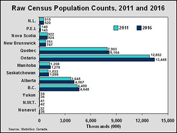

```{r setup, include=FALSE}
# if you need to install the packages 
# install.packages("broom")
# install.packages("tidyverse")
# install.packages("tinytex")
# install.packages("readr")
# install.packages("ggplot2")
# install.packages("sjPlot")
# install.packages("knitr")
# install.packages("jtools")

library(tidyverse)
library(readr)
library(tinytex)
library(ggplot2)
library(sjPlot)
library(jtools)
library(knitr)

gss <- read_csv("gss.csv")
```

# Abstract

The purpose of this analysis is to provide more insight on some predictors of home ownership. Through examining some key demographic variables in the 2017 General Social Survey such as family income, household size, marital status, and province, we were able to estimate the probability of a family choosing to rent over purchasing a home based on these predictors. Through our analysis, we found that factors such as lower family income and a respondent being separated or single increases the likelihood of a family renting a home.

# Introduction
 
We live in times where nearly every aspect of our lives have changed as a result of the on-going pandemic. If we were to compare the way we did things a year ago from today, we'd describe it as being markedly different. One of the biggest impacts the pandemic has had, is on the corporate world. Prior to our current times, remote work was certainly an option, however it was far from being the norm. This had multiple implications on housing. Individuals may have typically wanted to look for accommodation closer to their workplace and may have elected to rent as opposed to purchasing due to the nature of their job. A lot of these circumstances have changed; people aren't as tied to the physical location of their jobs anymore. This provides people with the opportunity to escape from expensive metropolises into the arguably more affordable smaller cities. This analysis is a snapshot of human history before a marked change. It will establish a reference point for us to analyze the factors that affect Canadian families and their decision to own or rent a home in a pre-covid world. 

To achieve this purpose, we are going to be looking at the General Social Survey  of Canada. The General Social Survey (2017) is a voluntary cross-sectional survey conducted by Statistics Canada that collected data on socioeconomic characteristics such as family origins and parental history. The General Social Survey  was used to look at the socio-demographic trends of families in Canada.  The survey is also used to provide policy makers and analysts with statistical information that can be used for planning health and social service programs. The data set contains several variables. However, we chose to look at family income, the family size, whether the respondent's family rents or owns, the marital status of the respondent, and the province in which the respondent resides. The purpose of this analysis is to extract possible factors that might affect a family choosing whether to rent or buy a home in Canada. To achieve this purpose, we will be fitting a logistic regression model on the data. The outcome we are trying to predict, is a binary value. As a result, a logistic regression model can be utilized.

The report starts with exploring the data. In this section, we detail the questionnaire that was used in the survey. We list out the methodology and the strengths and weaknesses of the survey. Additionally, the choice of variables is explained and some basic exploratory data analysis is presented. After the data has been introduced, there is a discussion around the model and why it was chosen. The results section will contain results from the modelling exercise and other charts from the survey data to supplement the model findings. The discussion section will feature a deep dive on the results and identify the outputs of the model. We find that factors such being married have a positive association with owning, and being in an income bracket under $50,000 has a positive association with renting.

# Data
```{r, echo = FALSE, message=FALSE}
## retrieving variables needed and filtering out possible NA values
cleaned_data <- gss %>% 
  select(marital_status, income_family, own_rent, hh_size, province) %>% 
  filter(marital_status != "NA", province  != "NA", own_rent  != "NA", hh_size != "NA", own_rent != "Don't know") %>% 
  mutate(own_rent = ifelse(own_rent == "Rented, even if no cash rent is paid", 1, 0)) #creating our binary variable

cleaned_data %>% as_tibble() %>% head()
```

To create our model, we have utilized the General Social Survey produced by Statistics Canada. This data is available for a fee using Statistics Canada's Real Time Remote Access tool. To procure this data, we have used the script provided by Professor Rohan Alexander. This script loads in the raw GSS data, cleans it up, and leaves with a tidied data set for us to do our analysis. We are using the most recently done survey. This was held in 2017. This data set is rich with several interesting variables that could be used for a variety of analyses. For our purposes, we've decided to select the following variables of interest are:

- *Household Income*: This is arguably one of the most important factors for choosing to rent or own. Having a stable income and the means to purchase would be typically necessary. Barring special circumstances such as an inheritance, a buyer will need to show some sort of stable income to qualify for a mortgage as well as put down money for the down-payment. In Canada, a minimum of 5% is required for properties that are below $500,000. 

```{r, echo=FALSE, message=FALSE}
# plotting distribution of family incomes
income_dist <- cleaned_data %>% 
  ggplot(aes(x = income_family)) + 
  geom_bar(aes(fill = income_family)) + 
  labs(title = "Figure 1: Household Income Range of Respondents", 
       x = "Income group", 
       y = "Count",
       caption = "Source: GSS 2017") + 
  theme_gray() + 
  theme(axis.text.x = element_text(angle = 35, hjust = 1, size = 5))

# plotting distribution of household size
household_size <- cleaned_data %>% 
  ggplot(aes(x = hh_size)) + 
  geom_bar(fill = "blue") + 
  labs(title = "Figure 3: Distribution of Household Size", 
       x = "Number of people in household", 
       y = "Count",
       caption = "Source: GSS 2017") + 
  theme_light()


# plotting distribution of marital status
marital_status_dist <- cleaned_data %>% 
  ggplot(aes(x = marital_status)) + 
  geom_bar(aes(fill = marital_status)) + 
  labs(title = "Figure 2: Marital Status of Respondents", 
       x = "Marital Status", 
       y = "Count",
       caption = "Source: GSS 2017") +
  theme_gray() + 
  theme(axis.text.x = element_text(angle = 35, hjust = 1, size = 5))

province_dist <- cleaned_data %>% 
  ggplot(aes(x = province)) + 
  geom_bar(aes(fill = province)) + 
  labs(title = "Figure 4: Which province do respondents reside in?", 
       x = "Province", 
       y = "Count",
       caption = "Source: GSS 2017") + 
  theme_gray() + 
  theme(axis.text.x = element_text(angle = 35, hjust = 1, size = 5))
```


- *Marital Status*: Our second variable of interest is the marital status of our respondent. It includes: Single(never married), Separated, Divorced, Widowed, Married, and Common-Law. There are a few reasons why this variable was included. There is first the effect of potentially having 2 incomes that can be pooled to purchase a house. We expect to see a positive association between Marriage/Common-Law and owning a property. By and large, most respondents appear to be married.

- *Size of the household*: One of the reasons that this variable was included was to observe a potential effect between increasing households and purchasing a house. The household size is capped at 6 in the data. It isn't clear if this is by design or just a result of the sample.
Potential reasons for household size influencing ownership might be that families may want to settle down and purchase a house in an area with a good school. The data shows that most households appear to house 1 to 2 people.

- *Province*: We included provinces to see if there are any associations between residing in a province and home ownership. The average price of a condominium in Toronto is ~\$720,000 and the average price of a condominium in Calgary is ~\$240,000. This marked price difference is one the reasons why we believe the Province will likely influence the decision to own a property. 


## Questionnaire:

The theme of this survey is family. As such, the questionnaire is designed with intent. All the questions  are related to family and address several topics. There are a total of 89 sections within the questionnaire. The sections contain at minimum one question. The sections the survey presents are quite broad but capture a great deal of depth in the detail about a household/individual,with key features such as, education, ethnic diversity, and housing. Statistics Canada reports that the survey was re-worked upon consulting respondents and implementing their feedback. Overall, the questionnaire is well written. A few of the criticisms include the length of the survey and minor intrusiveness of the questions. The survey is quite long, at minimum there are 89 questions, one for each section. Some sections have quite a bit more than that. Not all 89 sections will apply to every respondent, some of the sections would only be applicable if you qualify for it . For instance, there are 6 sections on relationship status, ranging from 1st/2nd/3rd marriage or 1st/2nd/3rd common-law union. If a respondent has only ever been married once or in one common-law union, they would not have to respond to the other sections as it doesn't apply to them. The questionnaire provides results that can be used for a plethora of analyses that might be useful for Canada's Minister of Families, Children and Social Development.

## Methodology

 The survey had a target population of non-institutionalized people, 15 years of age and older, living in Canada. As a sampling frame, a combination of land line and cellular telephone numbers from the Census, as well as other Statistics Canada administrative sources were used with a cross-sectional design, in which the data was collected from multiple individuals at once. The sample used a stratified probability sampling approach, dividing the 10 provinces into strata. Many of the geographic areas categorized as census metropolitan areas CMA) were considered separate strata(such as Toronto, Montreal, and Victoria). The non-CMA  areas were grouped to form 10 strata. This resulted in 27 strata in total. 

## Strengths

The surveys were collected from one randomly selected household member from each household, with 43,000 samples sent out. It was expected for 20,000 questionnaires to be completed. The survey had a high response rate, with 52.4% completion. Even with this response rate, to reduce non-response bias, survey weights were adjusted to account for non-response as much as possible using 2016 Census data. The data was enhanced by combining responses with information from personal and household tax data, gives more information to work with and draw more conclusions from. A minimum sample size was also used to ensure an acceptable amount of variability at the stratum level.

The survey is kept confidential under the Statistics Act of Canada. Under this act, surveyors are required to keep the respondent notified of what information is being collected and allows the respondent to object to the sharing of the information obtained by the survey as long as they give notice. Since 2014, Statistics Canada has also linked respondents to their personal tax records. 

## Weaknesses

One limitation when working with the data set is the ability to interpret the results. Without a considerable amount of data cleaning, the data is difficult to interpret in its raw form. The variance in cleaning methods could possibly lead to different finished data. This will also affect the reproducibility of this analysis. To combat this as best as possible, the cleaned GSS data could be made accessible via Github or any other hosting service.

Some of the questions may be perceived as intrusive, questions regarding the respondent's interactions with their parents or reasons for not marrying their partners might come across as excessive. Ultimately, this boils down to the respondent's comfort level. The results are anonymized, and they have the option to refuse. Questions relating to income had high non-response rates, and the reported income values were usually rough estimates.

# Model
##  Our choice of model: The Logistic Model

A logistic regression model is typically chosen to model the relationship between a binary response variable and categorical/continuous predictor variable.This model was primarily chosen due to our choice of a binary response variable, the decision to own or rent a property. This is a categorical variable where 1 represents being a renter, and 0 being an owner. The inputs to our model are the household income, marital status, household size, and the province in which they reside. As mentioned in the Data section, this data was pulled from the 2017 GSS dataset. Our model aims to estimate the model of homeownership. In our model, provinces are  p in the set of {Ontario, Alberta, British Columbia, Newfoundland and Labrador, Nova Scotia, Prince Edward Island, Quebec, Saskatchewan, Manitoba}. It allows us to model the relative importance of each predictor. We might find through this approach that the size of the household is not as important as household income is. This lets us focus on the most important variables for our analysis. Our decision to use a logistic regression to model ownership status has been well established in previous studies(Li, 1977) and particularly effective for house ownership analysis(Xhignesse et al, 2014). Linearly additive models have been noted to not be suitable for the task as they fail to model key interaction effects and are "inconsistent with the expectation of nonlinear effects"(Li,1977). Similar to our model, Mingche used variables such as "Income, family size, age of head, and race of head"(Li, 1977) as determinants of homeownership. As part of model checks and diagnostics, we ran a multi-collinearity test to see if our predictor variables correlate with each other. We utilized the vif function(calculates variance inflation factors) in the car package to run this diagnosis. Based on the output from the function, a VIF value greater than 5 indicates collinearity. All of our variables scored quite a bit below 5, indicating that our variables do not suffer from collinearity. We have fitted this model using the in-built **glm** function using the R language.

- y = owning or renting a home
- y = 1; The respondent's family rents a home
- y = 0; The respondent's family has purchased their home
- p = probability of a family renting a home

$$log( \frac{{p}}{1-{p}}) = \beta_0 + \beta_1x_1 + \beta_2x_2 + \beta_3x_3 + \beta_4 x_4 + .... +  \beta_n x_n$$ 

where the $\beta_n$ are the province, household income, factored size of household, and marital status respectively.


Through fitting a model using the chosen predictor variables, we are left with the given fitted logistic model with the following coefficients that are statistically significant at a 5% level:

Table 1: Logistic Regression Model coefficients using GSS data

| term                                	| estimate      	| std. error 	| statistic     	| p-value       	|
|-------------------------------------	|---------------	|------------	|---------------	|---------------	|
| (Intercept)                         	| -1.536117e+00 	| 0.10774238 	| -1.425732e+01 	| 4.036673e-46  	|
| Family Income >= $125,000      	      | -3.199217e-01 	| 0.08724207 	| -3.667058e+00 	| 2.453574e-04  	|
| Family Income between $25,000 to $49,999     	| 1.345248e+00  	| 0.07757781 	| 1.734063e+01  	| 2.321767e-67  	|
| Family Income between $50,000 to $74,999     	| 7.816801e-01  	| 0.07954586 	| 9.826786e+00  	| 8.633035e-23  	|
| Family Income between $75,000 to $99,999     	| 4.281441e-01  	| 0.08453086 	| 5.064944e+00  	| 4.085197e-07  	|
| Family Income less than $25,000      	| 1.806826e+00  	| 0.08298055 	| 2.177409e+01  	| 4.084666e-105 	|
| Marital Status: Living common-law     	| 2.283862e-01  	| 0.08483798 	| 2.692028e+00  	| 7.101894e-03  	|
| Marital Status: Married               	| -5.378767e-01 	| 0.07225698 	| -7.443942e+00 	| 9.772467e-14  	|
| Marital Status: Separated             	| 7.911402e-02  	| 0.09973070 	| 7.932765e-01  	| 4.276168e-01  	|
| Marital Status: Single, never married 	| 4.722803e-01  	| 0.06165262 	| 7.660344e+00  	| 1.854354e-14  	|
| Marital Status: Widowed               	| -5.455220e-01 	| 0.07307708 	| -7.465022e+00 	| 8.328555e-14  	|
| Province: British Columbia            	| 1.458332e-01  	| 0.08180104 	| 1.782779e+00  	| 7.462229e-02  	|
| Province: Manitoba                    	| -2.353981e-01 	| 0.10114481 	| -2.327337e+00 	| 1.994731e-02  	|
| Province: New Brunswick               	| -3.479253e-01 	| 0.09808148 	| -3.547309e+00 	| 3.891874e-04  	|
| Province: Newfoundland and Labrador   	| -2.477125e-01 	| 0.10562456 	| -2.345217e+00 	| 1.901602e-02  	|
| Province: Nova Scotia                 	| 4.255185e-02  	| 0.09245733 	| 4.602323e-01  	| 6.453495e-01  	|
| Province: Ontario                     	| 1.130780e-01  	| 0.07298057 	| 1.549426e+00  	| 1.212793e-01  	|
| Province: Prince Edward Island        	| 8.551564e-05  	| 0.11517302 	| 7.424972e-04  	| 9.994076e-01  	|
| Province: Quebec                      	| 3.371717e-01  	| 0.07517409 	| 4.485211e+00  	| 7.284169e-06  	|
| Province: Saskatchewan               	| -1.436655e-01 	| 0.10147665 	| -1.415749e+00 	| 1.568490e-01  	|
| Size of household: 2                 	| -4.032622e-01 	| 0.05619638 	| -7.175947e+00 	| 7.180824e-13  	|
| Size of household: 3                 	| -3.289402e-01 	| 0.06513425 	| -5.050187e+00 	| 4.413769e-07  	|
| Size of household: 4                 	| -5.830896e-01 	| 0.07454286 	| -7.822206e+00 	| 5.190573e-15  	|
| Size of household: 5                 	| -5.195130e-01 	| 0.10368158 	| -5.010659e+00 	| 5.424400e-07  	|
| Size of household: 6                 	| -4.066071e-01 	| 0.14586841 	| -2.787493e+00 	| 5.311766e-03  	|
```{r, echo = FALSE, include=FALSE}
#fitting the model
model <- glm(own_rent~ income_family + marital_status + province + as.factor(hh_size), family=binomial, data=cleaned_data)
```


```{r, echo = FALSE, include=FALSE,eval=FALSE}
car::vif(model)
```


# Results

```{r, echo=FALSE}
income_dist
```


```{r, echo=FALSE}
marital_status_dist
```


```{r, echo=FALSE}
household_size
```


```{r, echo=FALSE}
province_dist
```

As we can see in figure 1, there are 6 different income groups in the data set. As mentioned previously, the, questions pertaining to income in the data set high non-response rates. However when observing data from 2016 census data, we can see that the sample follows the same trends, such as the family income brackets with the largest proportion of respondents being \$125 000 and more, with \$25 000 - $49 000 coming in second. This suggests that the proportions we have for each income bracket is a good representation of family household in Canada. 

In figure 2, we can see that most respondents of the survey are married, and the least number of respondents are separated. In figure 3, we see that the highest number of respondents belong to a two-person household. 

In figure 4, we can see that an overwhelming amount of respondents reside in Ontario, with Quebec coming in second. According to a 2016 census, Ontario and Quebec had the largest population counts, with other provinces also following a pattern similar to the census data. The distribution of population count from the census data can be found in the appendix.

```{r,echo=FALSE, message=FALSE}
plot_model(model, vline.color = "red", sort.est = TRUE, title = "Figure 5: Odds Ratios of the Logistic Regression model")
```

Figure 5 provides a visual of the odds ratios of the logistic model fitted to our data. The odd ratios can be used to compare the relative odds of a respondent choosing to rent a home, depending on the variable of interest. An odd ratio greater than 1 indicates increased occurrence of an event, while an odd ratio less than 1 indicated decreased occurrence of an event.

By plotting these odd ratios we can see that families with incomes less than \$25 000 have the highest odd ratio. This means that a family being in this income bracket increases their odds of renting over buying a home. We can see that those odds decrease as income increases, with those earning over $125 000 having the lowest odd ratio out of all the income brackets. Having an income in this category actually decreases the odds of a family renting. When analyzing marital status, those who are single have the highest odds of renting. Those living common-law with a partner come to a second. Widowed respondents have the lowest odds of renting, followed by married respondents, where both have decreased odds of renting. A household size of 3 has the highest odds of a family renting a home, but family size overall seems to decrease the odds of a family choosing to rent. When looking at the provinces in which the respondents reside, Quebec has the highest odd ratio, followed by Ontario. Living in regions such as New Brunswick and Newfoundland decrease the odds of a family renting a home. An interest observation is that Prince Edward Island has an exact odd ratio of 1. This suggests that a respondent living in Prince Edward Island does not affect the odds of the person choosing to rent. 

## Survey Results

These results are different trends and charts that will be used to supplement the conclusions drawn from the model in the discussion section.

```{r, echo=FALSE, message=FALSE}
cleaned_data %>% 
  group_by(income_family, hh_size) %>% 
  tally() %>% 
  ggplot(aes(x = hh_size, y = n)) + 
  geom_col() + 
  facet_wrap(~income_family) +
  labs(title = "Figure 6: Distribution of Household size by household income",
       x = "Household Size",
       y = "Count",
       caption = "Source: GSS 2017 Data")
```
Figure 6 shows the distribution of household sizes when grouped by household income. We observe that respondents below a $50,000 income bracket are overwhelmingly one and 2 people households.


```{r, echo=FALSE, message=FALSE}
cleaned_data %>% 
  group_by(income_family, own_rent) %>% 
  tally() %>% 
  ggplot(aes(x = own_rent, y = n)) + 
  geom_col() + 
  facet_wrap(~income_family) +
  labs(title = "Figure 7: Distribution of ownership status by household income",
       subtitle = "0 being an owner, 1 being a renter",
       x = "Ownership Status",
       y = "Count",
       caption = "Source: GSS 2017 Data")
```
Figure 7 shows the distribution of ownership status household income. We can see that in income brackets larger than\$75 000 majority of respondents own their homes. The distribution of those who choose to rent is higher for those who are in the income bracket of less than $25 000.
```{r, echo=FALSE, message=FALSE}
cleaned_data %>% 
  group_by(income_family, marital_status) %>% 
  tally() %>% 
  ggplot(aes(x = marital_status, y = n)) + 
  geom_col() + coord_flip() +
  facet_wrap(~income_family) +
  labs(title = "Figure 8: Distribution of household income by marital status",
       x = "Marital Status",
       y = "Count",
       caption = "Source: GSS 2017 Data")
```
In figure 8, we can see that married is the highest count for marital status in all income brackets except for respondents who have a family income of less than $25 000. For these respondents, the most common marital status is single.

```{r, echo=FALSE, message=FALSE}
cleaned_data %>% 
  group_by(province, own_rent) %>%
  tally() %>% 
  ggplot(aes(x = own_rent, y = n)) + 
  geom_col() +
  facet_wrap(~province) +
  labs(title = "Figure 9: Distribution of ownership status by Province",
       subtitle = "0 being an owner, 1 being a renter",
       x = "Ownership Status",
       y = "Count",
       caption = "Source: GSS 2017 Data")
```
In figure 9, we can see that the number of those who choose to rent is higher for all provinces. However, we see a larger different in ownership status in the provinces Ontario, Quebec, and British Columbia. These provinces have a much larger proportion of those who rent.


# Discussion


- Looking at the odds-ratios in our model, we can see that household income has a pronounced effect on renting vs owning. For instance, households with income less than \$25,000 are significantly more likely to rent than others. This may come as no surprise since it's likely that households with that income aren't going to be saving nearly enough for basic needs. The Canadian Federal government utilizes a *MBM*(Market Basket Measure) as the official poverty line. The MBM represents the money needed for a family of 4 to meet their basic needs. The number varies from province to province, and whether they are part of a rural area or a large urban hub. Toronto has an MBM of \$48,000 for a family of 4 and an MBM of \$20,298 for a single person. Figure 7 shows that a considerable number of households in those income brackets below \$50,000 consist of 1-2 people households. In-spite of there being quite a few respondents under the MBM, Figure 8 indicates that roughly 40% of respondents making less than $25,000 own a property. This is quite a staggering result. In every income bracket after that, most of the respondents own the property. 

- A caveat to the above conclusion is the lack of context around location. While one of our predictors is the province, the prices of a house in Toronto are significantly higher than a house in Sudbury. For context, the average price of a single detached home in Toronto is \$1.4M, whereas the average price of a single detached in Sudbury is \$300,000. Clearly, there is a price discrepancy within a single province. This is somewhat reflected in the model as well, the log odds for a resident of Ontario is quite close to 1, indicating a slight positive association. We notice that other provinces tend to be negatively associated with renting.

- According to Figure 5, our model reports that a widower or a married person has a strong negative association with renting their property-meaning they are more likely to own. This makes sense as high income brackets tend to have significantly more married respondents. While that partly explains why married respondents own a house, the same cannot be said for widowers, they aren't strongly represented in a high income bracket. It is possible that their current house ownership is more reflective of their past income, when they had a partner to supplement it and thus afford to own a property. We actually observe a positive association with renting when looking at households with common-law arrangements. This is also in line with the financial conclusions of drawn above, they are fairly equally represented in each income bracket whereas married respondents have a strong skew in both the overall distribution(Figure 2) and when looking at high incomes(Figure 8). This tells us a few things, the pooling effect of 2 incomes is perhaps not as strong in common-law unions as it is in marriages. Also, those in common-law unions are less likely to own a house.  


## Weaknesses and next steps:

Some literature has established an interactive effect between certain variables(Li, 1977). Our model does not incorporate such interactions and is thus missing out on some significant interactions. While the variables we picked are well established in the literature, we missed out on an opportunity to include some other well established variables that would've let some more unique findings(Xhignesse et al, 2014). For instance, research has shown that ethnicity plays a role in home ownership(Li, 1977). In Toronto, certain ethnic minorities such as African and Caribbean minorities exhibit much lower rates of ownership, even when minimizing financial differences(Xhignesse et al, 2014). The GSS has included ethnicity and whether a respondent is part of a visible minority as variables. Replicating that study in 2020 provides us with an opportunity to assess whether social development policies have been effective. 

A variable that can be considered for further study is looking at the population center of the respondent. This would allow us to investigate the choices of those living in urban population centers compared to small rural/non-ruban areas. This is highly relevant in areas in Ontario, where housing is very expensive in urban bubbles such as Toronto, compared to areas in Ontario such as Kawartha Lakes. 

## Appendix
figure 10
```{r}


```

All code for this report and corresponding rmd file can be found at: "https://github.com/jaffaromain/Canadian-Social-Survey-Analysis"

## References
 
Government of Canada. Statistics Act (2020).                https://laws-lois.justice.gc.ca/eng/acts/S-19/FullText.h   tml

Hadley Wickham (2016). ggplot2: Elegant Graphics for Data   Analysis. Springer-Verlag New York

Hadley Wickham, Jim Hester and Romain Francois (2018).     readr: Read Rectangular Text Data. R package version      1.3.1.
 https://CRAN.R-project.org/package=readr

JJ Allaire and Yihui Xie and Jonathan McPherson and Javier  Luraschi and Kevin Ushey and Aron Atkins and Hadley
 Wickham and Joe Cheng and Winston Chang and Richard       Iannone (2020). rmarkdown: Dynamic Documents for R. R     package version 2.3. URL https://rmarkdown.rstudio.com.

Li, M. (1977). A Logit Model of Homeownership.              Econometrica, 45(5), 1081-1097. doi:10.2307/1914060

Long JA (2020). _jtools: Analysis and Presentation of
  Social Scientific Data_. R package version 2.1.0,
  URL: https://cran.r-project.org/package=jtools.
  
Lüdecke D (2020). _sjPlot: Data Visualization for           Statistics in Social Science_. R package version 2.8.5,   URL: https://CRAN.R-project.org/package=sjPlot.

Ontario Ministry of Finance (2020). 2016 CENSUS             HIGHLIGHTS: Factsheet                                     1.https://www.fin.gov.on.ca/en/economy/demographics/cens   us/cenhi16-1.html


Rohan Alexander and Sam Caetano (2020). GSS 2017 cleaning   data. University of Toronto. file: cleaning_data.Rmd

R Core Team (2020). R: A language and environment for 5     statistical computing. R Foundation for Statistical
  Computing, Vienna, Austria. https://www.R-project.org/.
  
Statistics Canada. (2017). General social survey (GSS).     https://www23.statcan.gc.ca/imdb/p2SV.pl?Function=getSur   vey&SDDS=4501

Statistics Canada (2020). Census Program.              https://www12.statcan.gc.ca/census-recensement/index-eng.cfm

Statistics Canada (2020). Table 11-10-0066-01 Market        Basket Measure (MBM) thresholds for the reference family   by Market Basket Measure region, component and base       year.


Sylvia J.T. Jansen (2020) Urban, suburban or rural?         Understanding preferences for the residential             environment, Journal of Urbanism: International Research   on Placemaking and Urban Sustainability, 13:2, 213-235,   DOI: 10.1080/17549175.2020.1726797
  
Wickham et al., (2019). Welcome to the tidyverse. Journal   of Open Source Software, 4(43), 1686,
  https://doi.org/10.21105/joss.01686
  
Xhignesse, Guillaume & Bianchet, Bruno & Cools, Mario &     Gathon, Henry-Jean & Jurion, Bernard & Teller, Jacques.   (2014). An Econometric Analysis of Homeownership
  Determinants in Belgium. 8581. 65-79.   10.1007/978-3-319-09150-1_6. 

Yihui Xie (2020). knitr: A General-Purpose Package for      Dynamic Report Generation in R. R package
  version 1.30.
  
Yihui Xie (2020). tinytex: Helper Functions to Install and   Maintain TeX Live, and Compile LaTeX Documents. R
  package version 0.26.
  
Yihui Xie and J.J. Allaire and Garrett Grolemund (2018). R   Markdown: The Definitive Guide. Chapman and Hall/CRC.
  ISBN 9781138359338. URL   https://bookdown.org/yihui/rmarkdown.
  


http://tug.org/TUGboat/Contents/contents40-1.html


